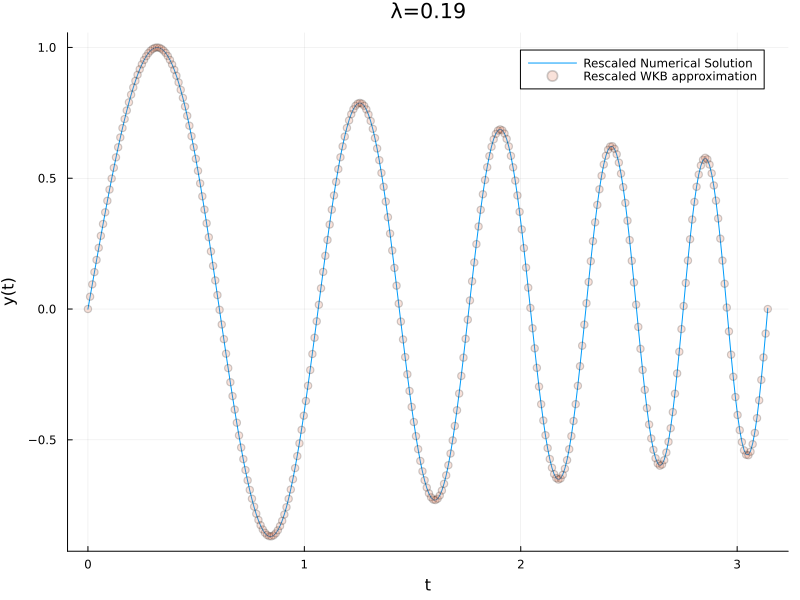
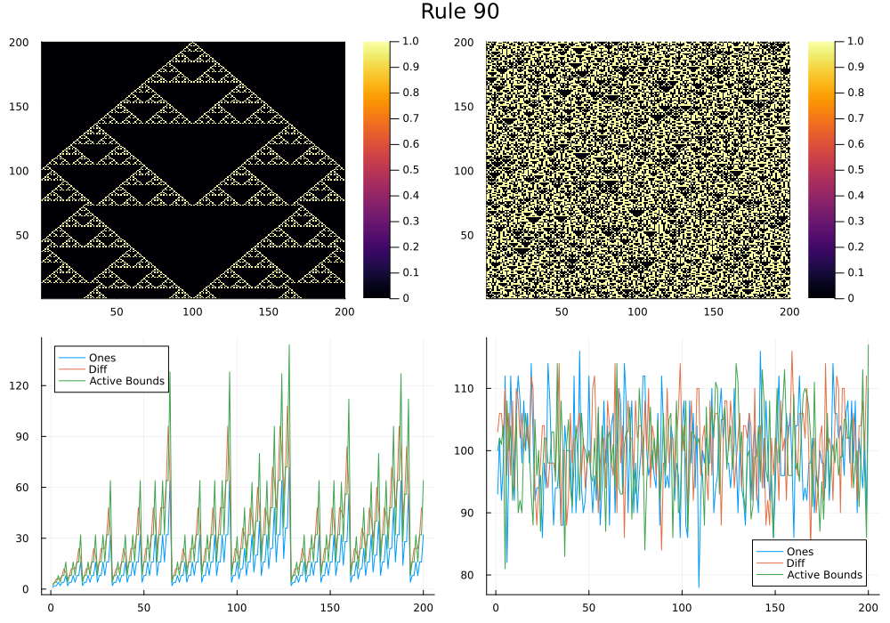
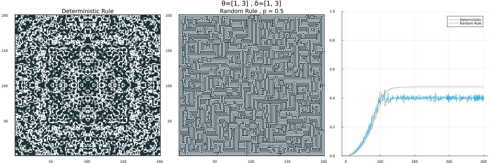
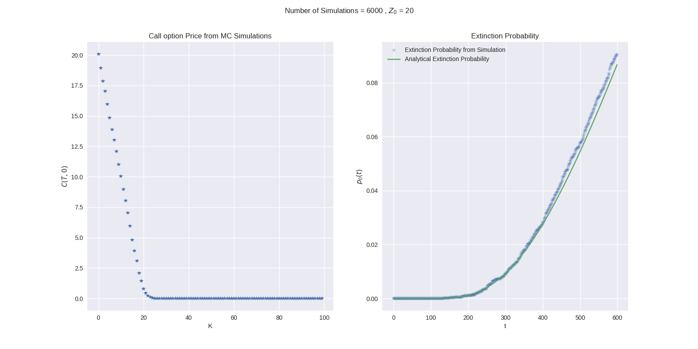

# WroclawAppliedMath

This repository contains code and implementations from my Master's studies in Applied Mathematics at Wroclaw University of Science and Technology (2024–2025).

# Pertubation Methods

# Agent-Based Modeling

# Computational Finance

